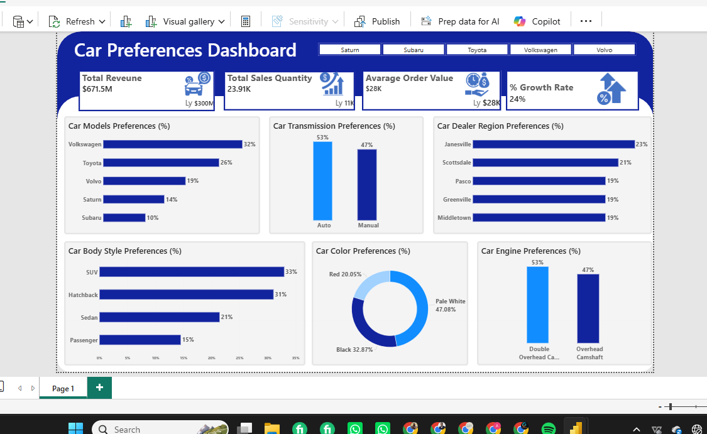
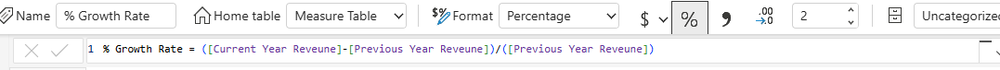
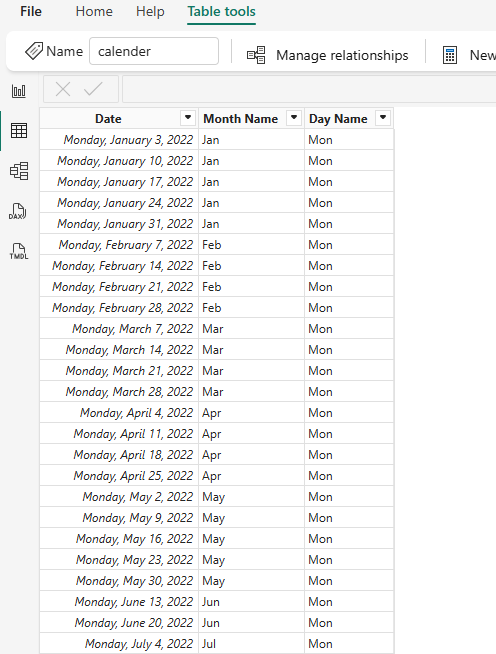
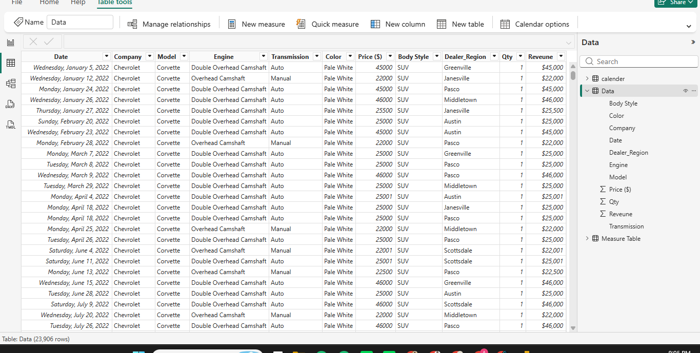
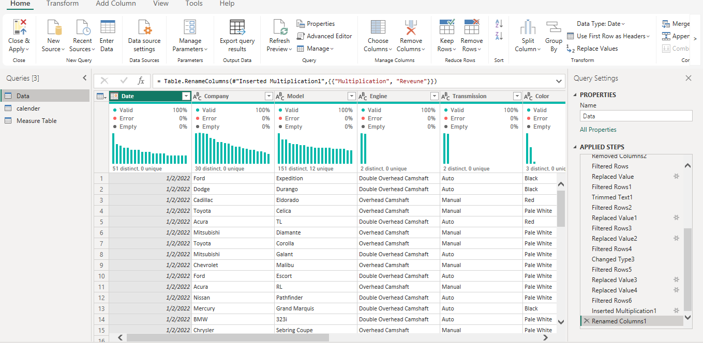
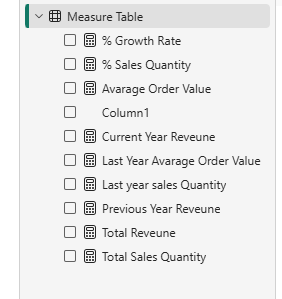
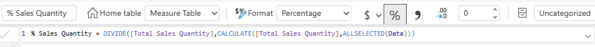
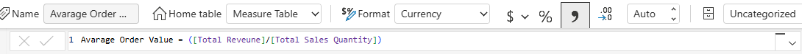

## 🚗 Product Preferences & Car Sales Analytics Dashboard (Power BI)

This project is a Power BI dashboard designed to give stakeholders a clear, centralized view of customer preferences across car models, colors, body types, transmission types, and dealer regions. Instead of relying on raw sales figures, key metrics are expressed as **percentages**, making it easier to compare products and understand relative popularity at a glance.

This project transforms raw car sales data into an interactive dashboard that helps stakeholders identify the most preferred vehicle attributes, track core sales KPIs, and understand how customer preferences shift by dealer region.

## 📌 Project Overview

Car dealerships and sales teams generate large volumes of transactional data — covering models, colors, body types, transmissions, and regional sales. Without a centralized way to view this data, spotting trends in customer preference and regional demand is difficult.

This Power BI report was developed to provide insight into:

- 📊 Key performance indicators — revenue, sales quantity, growth rate, and average order value
- 🚗 Market trends — the most preferred car models, colors, body types, and transmission options
- 📍 Regional preferences — how customer choices vary by dealer location
- 🏆 Top performers — categories with more than five labels are filtered to show only the Top 5 (e.g., car models are limited to the top five)

The report enables data-driven decision-making for sales strategy, inventory planning, and region-specific marketing.

## 🎯 Business Problem

Stakeholders need clear answers to key questions:

- Which car models, colors, body types, and transmission types are most preferred by customers?
- How do customer preferences vary across different dealer regions?
- What are the current trends in revenue, sales quantity, growth rate, and average order value?
- Where should sales and marketing focus their efforts based on regional demand?

Without a centralized dashboard, these insights stay buried across disconnected sales records.

This dashboard solves the problem by consolidating car sales and preference data into a single interactive Power BI report.

## 📊 Dashboard Structure

#### Project Overview
The completed Car Preferences Dashboard showing KPI cards (Total Revenue, Total Sales Quantity, Average Order Value, % Growth Rate) alongside visuals for Car Model, Transmission, Dealer Region, Body Style, Color, and Engine preferences — all expressed as percentages.

## 🛠️ Build Process (Data Model, Measures & Cleaning)

### Average Order Value Measure
DAX formula in the Measure Table calculating Average Order Value as Total Revenue divided by Total Sales Quantity, formatted as currency.

### Calendar (Date) Table
A custom date table showing Date, Month Name, and Day Name columns — used to support time-based analysis and drill-downs across the report.

### Raw Data Table
The core dataset (23,906 rows) containing car sales transactions with fields including Company, Model, Engine, Transmission, Color, Price, Body Style, Dealer Region, Qty, and Revenue.

### Power Query Data Cleaning
Power Query Editor showing the applied transformation steps (filtering rows, replacing values, trimming text, renaming columns) used to clean and prepare the raw data before loading it into the model.

### Measure Table Overview
List of all DAX measures created for the report, including % Growth Rate, % Sales Quantity, Average Order Value, Current/Previous Year Revenue, and Total Revenue/Sales Quantity.

### % Sales Quantity Measure
DAX formula calculating % Sales Quantity by dividing Total Sales Quantity by the ALLSELECTED total, formatted as a percentage — used to show relative share rather than raw counts.

### % Growth Rate Measure
DAX formula calculating % Growth Rate as the difference between Current Year Revenue and Previous Year Revenue, divided by Previous Year Revenue.

## 💡 Key Insights & Business Question Analysis

**Which car models, colors, body types, and transmission types are most preferred?**
Volkswagen leads customer preference at 32%, followed by Toyota at 26%, with Volvo, Saturn, and Subaru trailing behind. Pale White is the clear favorite color at 47%, well ahead of Black (33%) and Red (20%). SUVs (33%) and Hatchbacks (31%) dominate body style preference, while Sedans and Passenger cars make up a smaller share. Transmission preference is fairly balanced, with Automatic slightly ahead at 53% versus Manual at 47%.

**How do preferences vary by dealer region?**
Preferences are relatively evenly spread across dealer regions, with Janesville leading slightly at 23%, followed by Scottsdale at 21%. Pasco, Greenville, and Middletown each account for roughly 19% of preference share, suggesting no single region dominates demand and that regional marketing strategies may need to focus more on product mix than broad regional targeting.

**What do the revenue, sales quantity, and growth trends show?**
The dashboard reflects $671.5M in total revenue from 23.91K units sold, putting the average order value at roughly $28K per sale. Year-over-year growth stands at 24%, indicating strong upward momentum in both sales volume and revenue generation.

## 🚀 Strategic Recommendations

📍 **Focus Inventory on Top-Preferred Models**
Use the Top 5 model breakdown to prioritize stock for the most in-demand vehicles.

📊 **Align Regional Marketing with Preference Data**
Use the regional breakdown to tailor marketing campaigns to what each dealer region actually prefers.

## 🔚 Conclusion

This dashboard transforms raw car sales data into a strategic tool for understanding customer preferences. Instead of guessing which models, colors, or configurations are most popular, stakeholders can now see clearly what customers want and where — enabling smarter inventory, sales, and marketing decisions.

## ✨ Key Dashboard Features

- ✅ Percentage-based metrics for easy comparison across categories
- ✅ Top 5 filtering on categories with more than five labels
- ✅ KPI cards for revenue, sales quantity, growth rate, and average order value
- ✅ Regional breakdown of customer preferences

## 🛠️ Tools and Skills

- Microsoft Power BI
- Power Query
- DAX
- Data analysis
- Dashboard design
- Data visualization

**Report Status:** Active & Maintained
